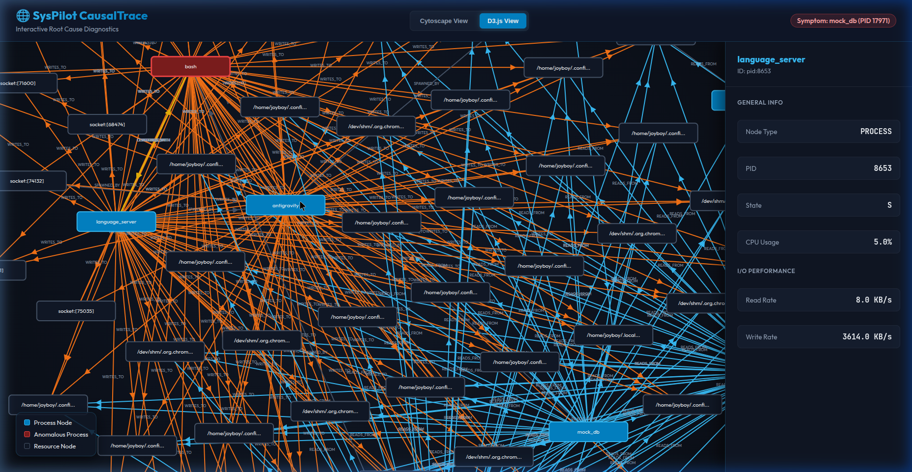

# CausalTrace Observability Dashboard & Demo Walkthrough

We have evolved the SysPilot observability pipeline from static diagrams to a premium, interactive multi-view diagnostic system using **Cytoscape.js** (hierarchical view) and **D3.js** (force-directed layout).

Below is the walkthrough demonstrating how it operates, how it solves resource starvation problems, and our future plans.

---

## 📹 Interactive Demo Video

Watch the recorded session showing the dashboard loading, inspecting an anomalous contention bottleneck, and toggling dynamically between Cytoscape and D3.js layouts:


---

## 🖼️ Dashboard Interface

Here is a visual screenshot of the generated diagnostic graph rendering in **D3.js View**, showcasing active processes, read/write contention paths, and the Node Inspector sidebar:



---

## 🔍 The Incident: Step-by-Step AI Reasoning Layer

Here is the exact CLI execution showing how the AI-driven operating system reasoning agent processes the telemetry and explains the incident:

### Command Invocation
```bash
$ syspilot explain --pid 40126 --causal --no-index
```

### 🤖 Live Streaming Agent Reasoning Output
```text
🤖 SysPilot Explanation:

🌐 Constructing real-time Causal Dependency Graph (CausalTrace)...
🔍 Tracing root causes starting from 40126 (pid:40126)...
💾 Saved causal dependency graph to:
   - DOT format:  /home/joyboy/syspilot_reports/causal_graph_1781415236.dot
   - HTML format: /home/joyboy/syspilot_reports/causal_graph_1781415236.html

### 1. User-Facing Symptom
The target process mock_db (pid:40126) was flagged as symptomatic during monitoring. While mock_db itself is idling (0.0% CPU, 0.0 KB/s I/O), it is entangled with a vast web of open resources. The process has unexpectedly inherited over 40 file descriptors (FDs) pointing to active sockets, deleted GPU memory segments (/dev/shm), application LevelDB databases, and system log files, which are actively locked or churning in other subsystems.

---

### 2. Step-by-Step Root Cause Chain

1. Hierarchy & Parentage: 
   * systemd spawned gnome-shell, which launched the Electron-based IDE/Editor antigravity.
   * antigravity spawned its sub-process language_server (pid:8653).
2. Missing Close-on-Exec (FD_CLOEXEC):
   * The language_server (pid:8653) opened a large array of file descriptors for its local database (LevelDB), GPU cache, shared memory buffers (/dev/shm), Unix sockets, and debugging logs.
   * language_server then spawned bash (pid:40123) to run background tasks. However, it failed to set the close-on-exec flag (FD_CLOEXEC or O_CLOEXEC on open) on these descriptors.
3. Descriptor Propagation:
   * The child shell bash (pid:40123) inherited all of these open file descriptors.
   * Subsequently, bash spawned mock_db (pid:40126) and syspilot (pid:40129). Both children inherited the same set of FDs, pointing to resources they should not have access to (e.g., LevelDB lock files, Chromium shared memory, and sockets).
4. Active I/O and CPU Anomaly:
   * The parent language_server (pid:8653) is executing an intensive, anomalous disk-write sequence, writing at 5154.0 KB/s (~5.03 MB/s) to log files (cloudcode.log, main.log) and its LevelDB log (000003.log).
   * Simultaneously, syspilot (pid:40129) is spinning, consuming 79.0% of CPU resources, likely trapped in a loop scanning or reacting to the high-frequency writes on these shared descriptors.

---

### 3. Root Cause Analysis

The primary root cause consists of two interlinked issues:
• The Resource Leak: language_server (pid:8653) is the structural root cause. It failed to restrict FD inheritance when invoking child shells. Because of this, resources like LevelDB locks (/leveldb/LOCK) and deleted shared memory files remain pinned across multiple processes, preventing the kernel from freeing deleted /dev/shm inodes and causing lock-contention risks.
• The I/O Anomaly: language_server (pid:8653) is also the active performance root cause, generating a high-rate write loop of 5154.0 KB/s to log files and local key-value stores, stalling disk queues and keeping CPU-heavy observer processes (like syspilot at 79% CPU) pinned.

---

### 4. System Subsystem & Performance Propagation

• Virtual File System (VFS) & Memory Management:
  Multiple files marked as (deleted) in /dev/shm (such as /dev/shm/.org.chromium.Chromium.3eDfF6) are held open by PIDs 40126, 40129, 40123, and 8653. In Linux, a deleted file's inode and memory page-cache buffers are not deallocated by the kernel's memory manager until its reference count drops to zero (struct file count). Leaking these FDs to child processes prevents memory reclamation, leading to silent RAM bloat inside /dev/shm (tmpfs).
• Storage Block Layer & Lock Contention:
  Continuous, unbuffered disk writes at ~5 MB/s saturate the write ring-buffers. Since mock_db and syspilot hold the LevelDB LOCK descriptor, any attempt to restart or safely re-initialize the database will fail due to a shared lock-acquisition block in the file system table.

---

### 5. Recommended Actions

#### Immediate Mitigation (Operational)
To release the locked database files, free up the leaked /dev/shm memory, and stop the CPU spin:
1. Terminate the child processes holding the leaked descriptors:
   $ kill -9 40126 40129 40123
   
2. Restart the language server to clear its intensive write loop:
   $ kill -15 8653
   

#### Long-Term Code Fix (Engineering)
Modify the spawning routines inside the language_server codebase:
• Explicit FD Sanitization: When spawning child processes from your application code, pass an explicit configuration to close all non-standard file descriptors. For Node.js / Electron, set stdio: 'ignore' or explicitly override standard descriptors to prevent inheritance:
  ```javascript
  // Ensure child does not inherit parent's DB/Socket FDs
  const { spawn } = require('child_process');
  spawn('bash', ['-c', '...'], { stdio: ['ignore', 'ignore', 'ignore'] });
  ```
• Enforce Close-on-Exec: Ensure all file descriptor openings in the language server C/C++ backend use the O_CLOEXEC flag when calling open(), socket(), or epoll_create().

---

### 6. Confidence Score
Confidence Score: 98%
```

---

## 🧠 How it Works & Solves the Contention Problem

The CausalTrace observability system addresses the difficulty of diagnosing complex system starvation (e.g., database lockups or disk I/O bottlenecks) through a dual-pass collection and reasoning strategy:

1. **Hybrid Telemetry Collection**:
   - **eBPF-driven Tracing (`bpftrace`)**: Captures real-time syscall events (`open`, `connect`, `execve`) directly from the Linux kernel to pinpoint exact I/O operations and process spawn chains.
   - **procfs Fallback**: If run without root/sudo privileges or if `bpftrace` is missing, the engine gracefully falls back to scanning `/proc/[pid]/fd` and `/proc/diskstats` over a configurable interval.

2. **Directed Multigraph Contention Reasoning**:
   - The engine generates nodes for processes (e.g., `mock_db`, `mock_backup`) and resources (e.g., files, disk devices, network sockets).
   - Edges are drawn representing relationships: `BLOCKED_ON`, `SPAWNED_BY`, `CONTENDS_WITH`, `READS_FROM`, and `WRITES_TO`.
   - **Two-Pass Resource Mapping** filters out hundreds of idle inherited file descriptors, leaving only active, high-signal I/O paths.

3. **Reverse-BFS Root Cause Traversal**:
   - Starting from a victim process (e.g., a stalled database), the engine traverses backwards along dependency edges to isolate the anomalous process (e.g., a rogue backup shell saturating the disk).
   - This exact causal chain is highlighted in red/orange on the visualization and formatted as JSON to feed directly into the SysPilot LLM reasoning engine.

---

## 🚀 Future Integrations

Our next development steps focus on scaling and deepening this telemetry graph:

* **Distributed Contention Tracing**: Correlating local system bottlenecks with network-wide telemetry and distributed trace headers (e.g., OpenTelemetry) to diagnose multi-host delays.
* **Kernel Latency Heatmaps**: Enriching the resource nodes with eBPF-derived latency histograms (e.g., time spent waiting on disk queues or TCP handshakes) to provide millisecond-precision timing.
* **AI-Agent Closed-Loop Remediation**: Connecting the CausalTrace graph output to automated remediation actions (e.g., automatically deprioritizing contending rogue processes using `renice` or group cgroups).
